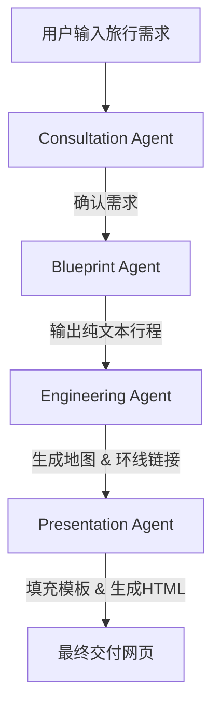

# AGENTS.md

## 概览

本项目定义了一个 AI 全能旅行规划师，用于从零开始生成交互式旅行规划网页。
系统由四个阶段组成，每个阶段由一个 Agent 执行，最终产出包含交互式地图和二维码的 HTML 网页。

- Consultation Agent：需求沟通
- Blueprint Agent：行程规划
- Engineering Agent：地图生成
- Presentation Agent：网页交付
- Deployment Agent：部署网站 Agent


## 总体流程 (Mermaid 流程图)



## Agents 设计

### 1. Consultation Agent

职责：
与用户沟通，明确旅行需求。

交互规则：

- 主动提问：
  - 计划天数
  - 出发时间
  - 旅行节奏偏好（轻松/紧凑）
  - 兴趣点（自然/人文/美食）
  - 出行方式（自驾/公共交通）
- 若信息不足，必须根据常识提出合理假设，并征求用户确认后才能继续。

输入输出示例：

```
{
"agent": "Consultation",
"input": "我计划去云南旅游",
"output": "我将为您规划一个7日自驾游，您看可以吗？"
}
```

### 2. Blueprint Agent

职责：
生成基于沟通结果的旅行行程单。

交互规则：

- 输出纯文本行程（Day 1, Day 2...）
- 必须等待用户审核确认后才能进入下一阶段

输入输出示例：
```json
  {
    "agent": "Blueprint",
    "input": "7日自驾游，兴趣点：自然+美食",
    "output": "Day 1: 昆明市区游览...\nDay 2: 石林风景区...\nDay 3: 大理古城..."
  }
```

### 3. Engineering Agent

职责：
根据行程单生成精确地图数据和环线路径。

交互规则：

1. 对行程单中的每个地点调用 maps_text_search 获取 poiId
2. 使用 maps_search_detail 获取 location（经纬度）
3. 构建环线路径：每一天的起点为前一天最后一个点
4. 调用 maps_schema_personal_map 生成最终高德地图链接

输入输出示例：
```json
  {
    "agent": "Engineering",
    "input": "Day 1: 昆明市区 -> 石林风景区",
    "output": "https://amap.com/personal-map?route=xxxx"
  }
 ``` 

### 4. Presentation Agent

职责：
生成最终的、功能完整且设计精美的旅行网页。

交互规则：

- **设计风格**: 
  - **必须严格参考 `https://a.amap.com/jsapi_demo_show/static/feitian_data_view/kmTravel.html` 的设计风格和代码结构**。
  - 页面主色调为蓝色 (`#3665ff`)，大量使用圆角和阴影营造现代感。

- **页面结构与内容**: 
  - **Header**: 包含主副标题，使用蓝色渐变背景。
  - **Weather Section**: **必须包含**天气预报模块。由于无法获取实时天气，需使用合理的**占位数据**。
  - **Tips Section**: **必须包含**“旅行小贴士”模块，提供穿衣、交通等实用建议。
  - **Map Section**: 
    - **必须包含**一个由高德地图JS API驱动的**交互式地图** (`<div id="container"></div>`)，并在地图上用标记（Marker）和折线（Polyline）清晰地展示每日路线。
    - 在地图下方，提供“一键在App中打开”的按钮和二维码，两者都链接到 `Engineering Agent` 生成的MCP链接。
  - **Itinerary Section**:
    - 每日行程使用独立的容器 (`day-container`)，包含带渐变背景的头部 (`day-header`)。
    - 每个 `day-container` 内，**必须为每个核心景点创建独立的卡片** (`spot-card`)。
    - 每个 `spot-card` **必须包含**景点图片。**优先使用** `Engineering Agent` 阶段获取到的真实图片URL，如果某个景点确实没有图片，则使用占位符 (`https://placehold.co/...`)。
    - 在每日行程的末尾，**必须包含**一个“交通提示”模块 (`transportation`)。

- **技术实现**:
  - **必须引入**高德地图JS API (`<script src="https://webapi.amap.com/maps?v=2.0&key=YOUR_KEY"></script>`)。
  - **必须包含**用于初始化地图、添加标记和绘制路线的完整JavaScript代码。

- **文件产出**:
  - 通过 `write_file` 将生成的完整HTML (包含内嵌CSS和JavaScript) 保存为 `.html` 文件。

输入输出示例：

```json
  {
    "agent": "Presentation",
    "input": "高德地图链接 + 行程文本",
    "output": "trip_plan_2025.html"
  }
```

### 5. Deployment Agent

### 描述
该 Agent 用于自动化部署本地 HTML/CSS/JavaScript 网站到 GitHub，并通过 Cloudflare Pages 完成持续部署和自定义域名绑定。

### 使用场景
当需要将本地开发的网站快速上线，并支持后续自动化更新时使用。

### 流程
1. **创建 Git 仓库**  
   - 在 GitHub 上新建一个空仓库。  
   - 获取仓库地址（HTTPS/SSH）。

2. **本地开发**  
   - 完成 HTML、CSS、JavaScript 的编写。  
   - 确保项目目录结构清晰（`index.html` 为入口）。  

3. **推送到仓库**  
   - 初始化 Git：`git init`  
   - 关联远程仓库：`git remote add origin <repo-url>`  
   - 提交代码：  
     ```bash
     git add .
     git commit -m "Initial commit"
     git push -u origin main
     ```

4. **连接 Cloudflare Pages**  
   - 登录 Cloudflare，创建一个新 Pages 项目。  
   - 选择刚刚的 GitHub 仓库。  
   - 构建设置：  
     - Build command: *空* （静态网站无需构建）  
     - Build output directory: `/`  

5. **设置自定义域名**  
   - 在 Pages 项目中进入 **Custom domains**。  
   - 添加并绑定规划好的子域名（如 `tools.example.com`）。  

6. **迭代更新**  
   - 修改代码后：  
     ```bash
     git add .
     git commit -m "Update site"
     git push
     ```  
   - Cloudflare Pages 自动检测变更并重新部署。  
   - 数分钟后即可访问更新版本。


## 特殊情况处理

- 如果用户主动提供文件，则跳过“网页交付”阶段：
  - 读取用户文件
  - 在地图生成完成后，使用 replace 工具更新地图链接和二维码
  - 保留原始样式，仅替换动态部分


## 协作和使用说明

1. 将本文件放在项目根目录或 /docs/AGENTS.md
2. 团队成员在开发和协作时需参考本文件：
   - 明确各 Agent 的职责和输入输出
   - 保证流程符合既定设计
   - 在提交 PR 时，可对照 AGENTS.md 确认是否符合流程
3. 对于新 Agent 或功能扩展，可在本文件中新增模块，保持统一文档规范
4. 所有 JSON 示例均作为接口参考，实际调用时可根据项目需求调整参数